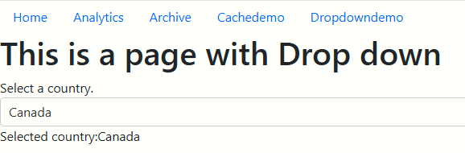

[[_TOC_]]

# Overview
- This is a Python web application built using Flask
- The base template uses simple Bootstrap CSS navigation for displaying child links


---

# Current deployment

- **DEV**-https://app-saupythonflask001-dev.azurewebsites.net/
- **PROD**-https://app-saupythonflask001-prod.azurewebsites.net/
---

# Source code structure

## Top level folders
- **.azuredevops**-ARM template and YAML template files
- **src**-Python source code
- **docs**-Documentation, picture files

## Detailed structure

```
---.azuredevops
    |
    |---deploy.ps1
    |
    |---templates
    |        |
    |        |
    |        ----[bicep templates for web app and service plan]
    |
    |
---src
    |
    |
    |---app.py
    |
---cicd.yml
```
---

## Which folder to use for launching VS Code ?

For best developer experience, launch the Flask web app using the **webfrontend** as the root folder. This gives you the opportunity to customize the lauch actions specifically for Flask.


# Debugging the Flask app

## Option-1-Use the Launch Settings
This uses the out of box VS Code Flask debugger

## Option-2-Run flask from Terminal

Use the following option when you do not want to step into the code but want to keep reloading the changes. Useful to rapid feedback.

```
flask run --debug
```

---

# Challenges with Dash and integrating with Flask

## Key take aways
Dash works in a very different way to Flask. 
- **Easy** - If you want to make Dash as the primary web server
- **Not so easy** - If Flask is your primary web server and you want to have a few pages which are Dash implementation

## Lesson - Dash app should be created only once
https://community.plotly.com/t/limit-on-multiple-dash-apps-running-simultaneously/74477/7

## Lesson - Multi pages (official sample)
Demonstrates the usage of `register_page` to register multiple routes
- https://dash.plotly.com/urls

## Lesson - Another example of register_page
- https://stackoverflow.com/questions/73505769/is-it-possible-to-register-dash-pages-from-an-external-module

```
app.py
/modules
  foo.py
  home.py
```
## Reference   -Integrating Dash with Flask
https://hackersandslackers.com/plotly-dash-with-flask/
Good article and hilights some of the challenges. But,this does not use `multi pages` approach

https://github.com/tzelleke/flask-dash-app/blob/master/app/dash/demo.py
Good sample. But, this too does not use `multi pages` approach

## Dash - Basic callbacks
This is a nice demo. Restrict to single Dash instance.
https://dash.plotly.com/basic-callbacks

## Flask and Dash - integrating via IFRAME
Looks like a sensible approach to keep compexity low
https://stackoverflow.com/questions/74762322/integrating-dash-and-flask-by-inserting-dash-chart-into-div-block-of-flask-templ


## Lesson - Multiple Dash instances - What did I try in the app.py and did not work
This does not work. You can only create a single instance of Dash. You will have to use the "multi-page" approach (see far below)

```python
#First dash page registration
from views.dashdemo1 import make_dash, make_layout, define_callbacks
dash_app = make_dash(app)
dash_app.layout = make_layout()
define_callbacks()

#Second dash page registration
import views.dashdemo2 as dashdemo2
dashdemo2.DashDemo2.register_page()
#dashdemo2.DashDemo2.make_dash(server=app)

```

## Sample using IFRAME approach
https://towardsdatascience.com/embed-multiple-dash-apps-in-flask-with-microsoft-authenticatio-44b734f74532
This uses Bootstrap extensively. Need to read in depth

---

# Plotly reference

## Plotly JSON online editor
https://plotly.com/chart-studio-help/json-chart-schema/#online-json-editor


## Plotly Express demo code
Nice demo. This embeds a `graphJSON` variable from the route handler
https://www.geeksforgeeks.org/create-a-bar-chart-from-a-dataframe-with-plotly-and-flask/


# Hmtl forms

## Bootstrap styling
https://www.w3schools.com/bootstrap5/bootstrap_forms.php
https://getbootstrap.com/docs/5.0/forms/form-control/

## How does basic form submission work?
https://developer.mozilla.org/en-US/docs/Learn/Forms/Sending_and_retrieving_form_data

# Flask reference
## Form submission demo from DigitalOcean
https://www.digitalocean.com/community/tutorials/how-to-use-web-forms-in-a-flask-application

## Populate the items of a SELECT element 
https://www.appsloveworld.com/coding/flask/49/how-to-populate-a-html-dropdown-dynamically-with-values-from-a-postgres-database

## Set the default selection of a SELECT element
https://www.geeksforgeeks.org/how-to-set-the-default-value-for-an-html-select-element/

# Flask/Jinja rendering - escaping HTML
https://stackoverflow.com/questions/3206344/passing-html-to-template-using-flask-jinja2

---

# Plotly next steps

## How to customize the rendering of the tooltip ?
https://plotly.com/python/creating-and-updating-figures/
Look for 'hovertemplate' for an example

https://plotly.com/python/hover-text-and-formatting/
Better guidance on hover template 
- Example of Sine curve with a hovering vertical line
- Example of X and Y hover lines (Styled spike lines)


## How to make subplots ?
Search for subplot
https://plotly.com/python/creating-and-updating-figures/


## How to add traces ?
Search for "add traces" 
https://plotly.com/python/creating-and-updating-figures/


## How to have bar and scatter plots in a single figure ?
Look for the code snippet which has `add_bar` , `add_scatter` in a single
https://plotly.com/python/creating-and-updating-figures/


## Updating figure axes
Search for "Updating Figure Axes"
https://plotly.com/python/creating-and-updating-figures/


## Pie Chart

https://chart-studio.plotly.com/~Dreamshot/8254/most-popular-content-management-systems/#code


---

# Public gallery of Plotly (Similar to JSFiddle)

https://chart-studio.plotly.com/feed/#/


# Sample Dash applications

## Official documentation (Multi-page support)
https://dash.plotly.com/urls (**Important!** see layout functions or layout variable)

## Mixing Dash and Flask
https://ploomber.io/blog/dash-in-flask/


## Lots of Dash examples here
https://community.plotly.com/t/examples-of-multi-page-apps-with-dash-pages/66489

## Storing data between callbacks
https://dash.plotly.com/sharing-data-between-callbacks


# Caching in Dash

https://dash.plotly.com/performance#memoization


---
# Navbar in Dash

## dbc.NavbarSimple

```python
import dash_bootstrap_components as dbc

navbar = dbc.NavbarSimple(
    children=[
        dbc.NavItem(dbc.NavLink("Page 1", href="#")),
        dbc.DropdownMenu(
            children=[
                dbc.DropdownMenuItem("More pages", header=True),
                dbc.DropdownMenuItem("Page 2", href="#"),
                dbc.DropdownMenuItem("Page 3", href="#"),
            ],
            nav=True,
            in_navbar=True,
            label="More",
        ),
    ],
    brand="NavbarSimple",
    brand_href="#",
    color="primary",
    dark=True,
)
```

https://dash-bootstrap-components.opensource.faculty.ai/docs/components/navbar/


## dbc.Nav

```python
import dash_bootstrap_components as dbc

nav = dbc.Nav(
    [
        dbc.NavLink("Active", active=True, href="#"),
        dbc.NavLink("A link", href="#"),
        dbc.NavLink("Another link", href="#"),
        dbc.NavLink("Disabled", disabled=True, href="#"),
    ]
)
```



https://dash-bootstrap-components.opensource.faculty.ai/docs/components/nav/#

---

# All other references

## Python formatter in VS Code
Configuring a formatter will tidy up the formatting when the file is saved. Using **autopep8** for this project.
https://code.visualstudio.com/docs/python/formatting


## Hello Dash live demo
https://hellodash.pythonanywhere.com/

## Dash Cheat Sheet (with BootStrap)
https://dashcheatsheet.pythonanywhere.com/

## Tabs
https://dash-bootstrap-components.opensource.faculty.ai/docs/components/tabs/
